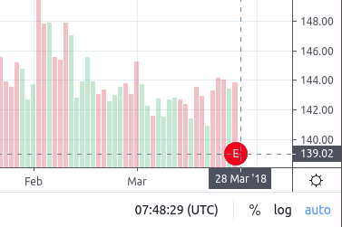

# 在K线上做标记

图表库支持显示[K线标记](#K线标记) 和[时间刻度标记](#marks-on-the-timescale)。 如果[支持它们](JS-Api.md#supports_marks)，则会从您的后端请求标记。 标记旨在让您能够显示附加到K线/时间刻度的事件。 这里有一些例子：

* 新闻
* 一些比较特殊的K线配置
* 拆分/股息
* 等等

您可以使用 [subscribe(event, callback)](Widget-Methods.md#subscribeevent-callback) Widget 方法订阅标记事件。 此外，还有[刷新标记](Chart-Methods.md#refreshmarks)和[清除标记](Chart-Methods.md#clearmarks)的图表方法。

## K线标记

K线标记是带有自定义大小和颜色的彩色圆圈，里面有一个字母。 一个K线可以有几个标记。当用户单击标记时，会出现工具提示。 工具提示可以包含 HTML 代码或纯文本。

例如:

图表库使用 [getMarks() JS API 方法](JS-Api.md#getmarkssymbolinfo-from-to-ondatacallback-resolution) 和 [/marks UDF 请求](UDF.md#marks) 为可见数据范围请求K线上的标记。

## 时间刻度标记

时间刻度上的标记基本上是时间刻度上方的棒棒糖。 每个标记内部都有自定义字母和带有一两个信息字符串的弹出工具提示。

如果[支持]，则从您的后端请求标记(JS-Api.md#supports_timescale_marks)。

例如:

时间刻度上的标记由图表库使用 [getTimescaleMarks() JS API 方法](JS-Api.md#gettimescalemarkssymbolinfo-from-to-ondatacallback-resolution) 和 [/timescale_marks UDF 请求](UDF.md#timescale-marks）。
